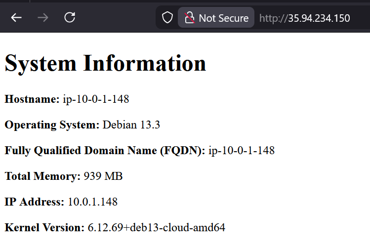

the following is the command to create a new key:
```bash
ssh-keygen -t ed25519 -f ~/.ssh/aws -C "week7 lab key"
```
the previous command creates a key of type ed25519 and puts the key in .ssh named the aws file with the comment week7 lab key 

the following is the command to run the included scripts to import the key
```bash
chmod +x import_lab_key
./import_lab_key ~/.ssh/aws.pub
```
the commands first make the import_lab_key executable then i pass the directory of the aws key to the import_lab_key as needed by the file 

the following is the command to run the included scripts to delete the key
```bash
chmod +x delete_lab_key
./delete_lab_key
```
the commands first make the delete_lab_key then i run the delete_lab_key after going through the whole lab to clean the keys from my account 

the following are the terraform commands I ran inside the terraform directory
```bash
terraform init
terraform fmt
terraform validate
terraform plan main.tf
terraform apply 
```
the commands first initialize the terraform directory then i ran terraform fmt and validate to format the terraform file and validate that it is written in the correct syntax and with no breaking errors i then run terraform plan on the main.tf file and after the plan is run i then apply the plan 

the following are the ansible commands I ran inside the ansible directory
```bash
ansible-playbook --syntax-check -i inventory/hosts.yml playbook.yml
ansible-playbook -i inventory/hosts.yml playbook.yml
```
the previous commands first check the syntax of the playbook.yml file to ensure that the syntax of it is correct and nothing i wrote in it broke the file after making sure the file is created properly i ran the second command to run the playbook and point it to my inventory file with the -i tag

the following is the screenshot of my rendered html page from one of my servers
